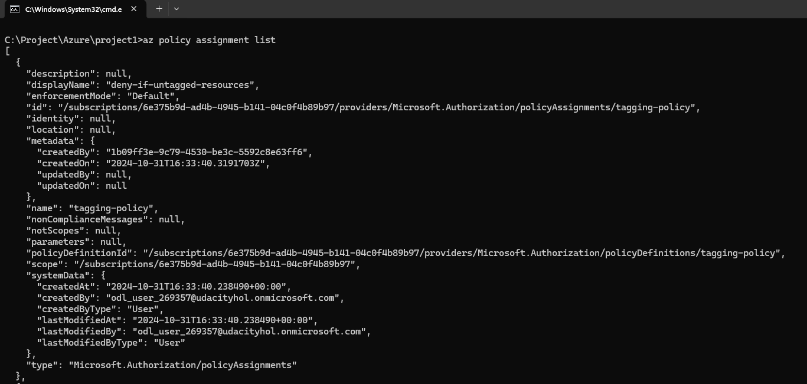
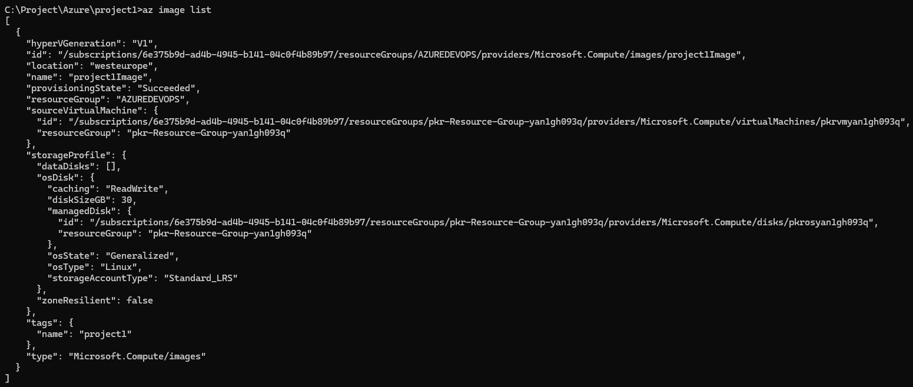

# Azure Infrastructure Operations Project: Deploying a scalable IaaS web server in Azure

### Introduction
For this project, you will write a Packer template and a Terraform template to deploy a customizable, scalable web server in Azure.

### Getting Started
1. Download project1-AzureInfrastructureOperations zip file

### Dependencies
1. Create an [Azure Account](https://portal.azure.com) 
2. Install the [Azure command line interface](https://docs.microsoft.com/en-us/cli/azure/install-azure-cli?view=azure-cli-latest)
3. Install [Packer](https://www.packer.io/downloads)
4. Install [Terraform](https://www.terraform.io/downloads.html)

### Instructions
1. Download project1-AzureInfrastructureOperations zip file
2. Authenticate into Azure
    ```
    az loggin
    ```
3. Create the Policy Definition
    ```
    az policy definition create --name tagging-policy --display-name "deny-if-untagged-resources" --description "This policy ensures all indexed resources in your subscription have tags and deny deployment if they do not." --rules "project1-policy.json" --mode All
    ```
4. Create the Policy Assignment
    ```
    az policy assignment create --name tagging-policy --display-name "deny-if-untagged-resources" --policy tagging-policy
    ```
5. List the Policy Assignments to verify
    ```
    az policy assignment list
    ```
6. Create a Server Image with Packer
    - Get application id, secrect key, subscription id in your Service Principal Details when you create Udacity Lab
    - Fill in variables section in the server.json file
        ```
        "variables": { 
            "arm_client_id": "application id", 
            "arm_client_secret": "secrect key", 
            "arm_subscription_id": "subscription id" 
        }
        ```
    - Create image
        ```
        packer build server.json
        ```
    - View images
        ```
        az image list
        ```
7. Create the infrastructure with Terraform
    - Variables from vars.tf are called from mains.tf, for example the variable prefix is called: 
        ```
        ${var.prefix}
        ```
    - In vars.tf, the description and value are specified in the follwing way:
        ```
            variable "prefix" { 
            description = "The prefix which should be used for all resources in this example" 
            default = "udacity-duongtm7-project1" 
        }
        ```       
    - Review and change all variables according to your environment in vars.tf file.
8. Deploy infrastructure
    - Initialize a working directories
        ```
        terraform init
        ```
    - Create infrastructure plan
        ```
        terraform plan -out solution.plan
        ```
    - Deploy the infrastructure plan
        ```
        terraform apply "solution.plan"
        ```
    - View infrastructure
        ```
        terraform show
        ```
    - Destroy infrastructure (After completing the deployment)
        ```
        terraform destroy
        ```
    - Delete images (After completing the deployment)
        ```
        az image delete -g Azuredevops -n project1Image
        ```
### Output
1. az policy assignment list
    
2. az image list
    


